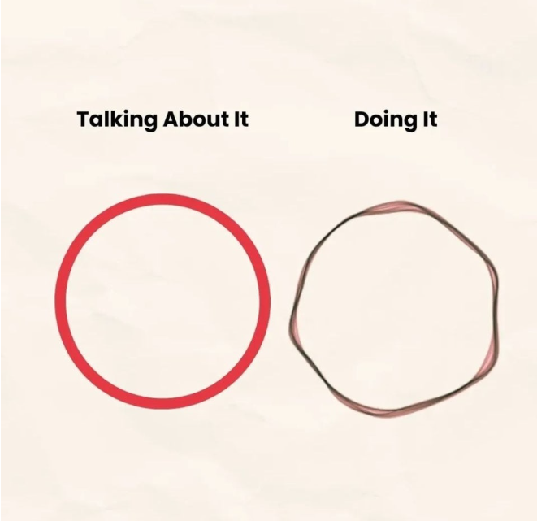
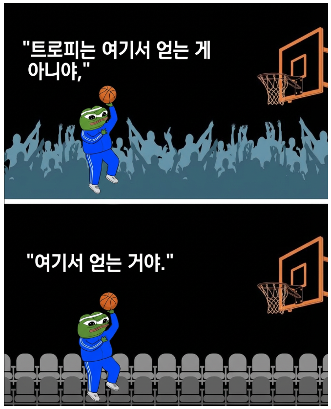

# 채영이와 함께하는 노트

### 아빠가 하고싶은 말

- 세상에서 가장 사랑하는 채영아!
- 좋은말도 떄론 듣기싫고 꼰대처럼 보인다는것도 알지만 아빠는 늘 걱정하는 마음으로 고민하고 있어.
- 살아보니 하나님께서 만든 세상이 늘 공평하지만도 아름다운것만도 아니더라.
- 속물같이 들릴수도 있겠지만, 좀 더 현명하게 살아갔으면 하는 바램으로 한마디 할까해!
<!-- - 채영이가 좋아하고 흥미로운 것이 있다면  -->

---
### 아빠가 말씀해준 좌우명

<table>
  <tr align="center">
    <td width="150"><b>가족</b></td>
    <td width="650"><b>좌우명</b></td>
  </tr>
  <tr>
    <td align="center"><b>아빠</b></td>
    <td>
      극기상진, 克己常進 (克:이길 극, 己:자가자신 기, 常:항상 상, 進:나아길 진)  
      나 자신을 이기고, 항상 앞으로 나아가자!
    </td>
  </tr>
  <tr>
    <td align="center"><b>찬영</b></td>
    <td>
      꿈을 날짜와 함께 적어 놓으면 목표가 되고,  
      목표를 잘게 나누면 그것은 계획이 되며  
      그 계획을 실행에 옮기면 꿈은 실현되는 것이다.
    </td>
  </tr>
  <tr>
    <td align="center"><b>준영</b></td>
    <td>
      미래는 꿈꾸는 자의 것이요  
      승리는 준비된 자의 몫이다
    </td>
  </tr>
  <tr>
    <td align="center"><b>채영</b></td>
    <td>
      실수를 하지 않으려고 너무 애쓰지마라.  
      중요한 것은 어떤 실수를 하던지간에 그것으로 부터 빨리 배우는 것이고,  
      절대 포기하지 않는 것이다.
    </td>
  </tr>
</table>

---
### 말로 이해하는 것보다 실천하는 것은 어렵다!

<table>
  <tr align="center">
    <td> </td>
    <td> </td>
    <td> </td>
  </tr>
</table>

- 머리로 이해하는 것과 실행하는 것은 아주 큰 갭이 존재한다.
- 방법은 널려있지만, 직접 결과를 만들어 내는 **'실천의 근육'** 은 단련한 사람만이 가질 수 있다.

---
### 트로피의 영광은 어떻게 만들어지는가?

- 대부분의 사람들은 큰경기와 중요한 이벤트에서 이기는것이 그사람을 유명하게 만들었다고 생각한다.
- 발전은 혼자 있을때 고민과 반복으로 이뤄지는 것이란다.

---