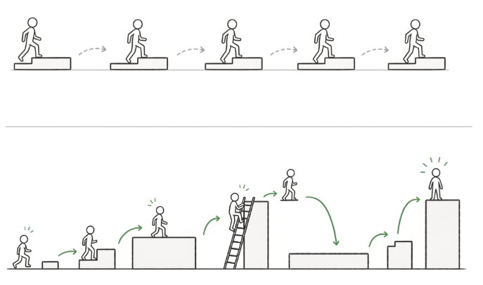
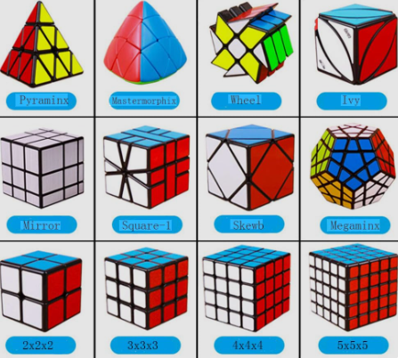
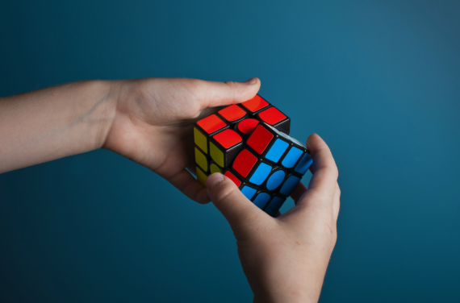

# 학습방법
> 학교공부를 위한 팁

### INDEX
- 1️⃣ [영어](./S01_영어/)
- 2️⃣ [수학](./S02_수학/) 

---
### 영어공부
> 구슬이 서말이라도 꿰어야 보배
 
- **꾸준히 구슬을 하나씩 모아 나가기.** 
  - **'꾸준함'** 은 매일 똑같이 하는 것이 아니라,  
    **하기 싫은 날에도 조금씩 해보는 것.**  
    **멈추지 않는** 걸 말하는 것이란다.
  - 그래서, 시간과 끈기가 필요하다.

- 아무리 좋은것도 **활용하지 않으면 보배가 되지 않는다.**
  - 힘들게 노력한 결과들이 머리속에서만 있고 밖으로 나오지 않는다면 좀 억울할 거 같애.
  - 어떤 방법으로든 꼭 활용이 되어서 노력의 결과에 대한 성취감을 맛봤으면 해.

---
### 수학공부
> 스텝바이스텝, 순서대로 차근차근!

- **계단을 한칸씩 오르듯 급하게 서두르지 않고,** 단계를 밟아가며 착실하게 앞으로 나아가기.
- 문제를 하나씩 해결하며 최종 목표에 도달하는 방식
- **어려운 문제를 해결하면 쉬운 문제는 저절로 해결된다!!**

<table>
  <tr align="center">
    <td></td>
    <td></td>
  </tr>
</table>

---

