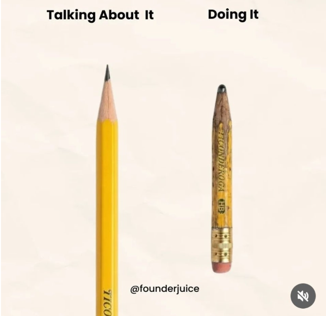

# 학습방법
> 학교공부를 위한 팁

### 말을 이해하는 것보다 실천하는 것은 어렵다!

<table>
  <tr align="center">
    <td> </td>
    <td> </td>
    <td> </td>
  </tr>
</table>

- 머리로 이해하는 것과 실행하는 것은 아주 큰 갭이 존재한다.
- 방법은 널려있지만, 직접 결과를 만들어 내는 **'실천의 근육'**은 단련한 사람만이 가질 수 있다.

---
### 트로피의 영광은 어떻게 만들어지는가?

- 대부분의 사람들은 큰경기와 중요한 이벤트에서 이기는것이 그사람을 유명하게 만들었다고 생각한다.
- 발전은 혼자 있을때 고민과 반복으로 이뤄지는 것이란다.

---
### 아빠가 하고싶은 말

