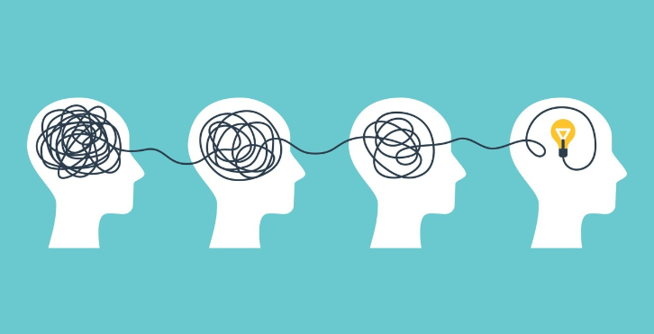

# 시험 리뷰

- 공부란 내가 모르는 것을 하나씩 알아 나가는 것
  - 몰랐던 문제
  - 틀렸던 문제
  - 햇갈린 문제
- 똑같은 실수는 하지 말자
  - 오답 노트가 중요
  - 약한 과목일수록 복습에 충실
- 나의 강점과 약점을 파악 
  - 유형을 분석하고 파악하자
  - 어느곳에 먼저 집중해야할지 알수있다.
  - 아무리 복잡하고 어려운 문제도 하나씩 풀다보면 어느순간 해결된다.

 

---